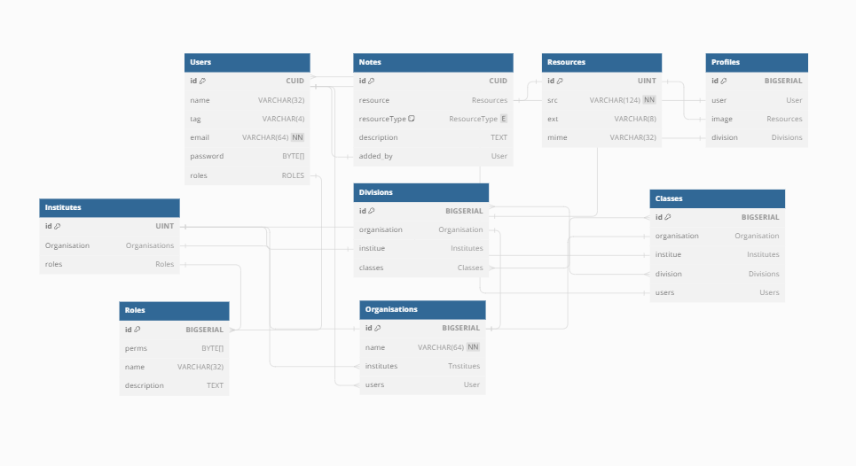

# Database migration repository


This repository contains all Database management for edunota tools like migrations, backupbs, ..etc

## submodules
    - infrastructure

to update submodules run command
```bash
git submodule update --remote --merge
```


## Current database schema


you can see interactive diagram [here](https://dbdiagram.io/d/6502197c02bd1c4a5e865426)


# Database docs
## Roles 
created by organizations,institutes, divisions, classes and by groups
```ini
    ---    
    [role] 
    id = role id
    perms = permissions of this role
    name = role name
    description = role description
    ---   
```
## Users 
every single person (admins, moderators, employees, academicians, teachers, students.. etc) present as user
```ini
    ---
    [user] 
    id = primary key for user
    name = user name, must not contain whitespace
    tag = an hexadecimal number for indefiying user kerim#3231  means user is the 3231nth of kerim
    password = hashed user password also stored as byte array instead of plain text
    profile = a profile linked to this user, like profile foto, status, current organisation, job etc
    documents = documents pushed by this user
    ---
```
## Organizations

organisations presented as main legal entity in edunota, universities, classrooms, colleges, highshools
```ini
    ---   
    [organisation] 
    id = organisation id
    perms = permissions of this role
    name = role name
    description = role description
    istitues = institues belongs to this organisation
    ---   
```


## Institutes

institues is sub organization belongs an organization, institues can be presented as highools, facilities etc
```ini
    ---   
    [Institute] 
    id = Institutes id
    name = role name
    description = role description
    organization = 
    ---   
```